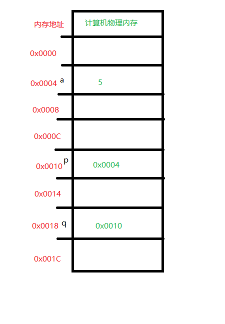
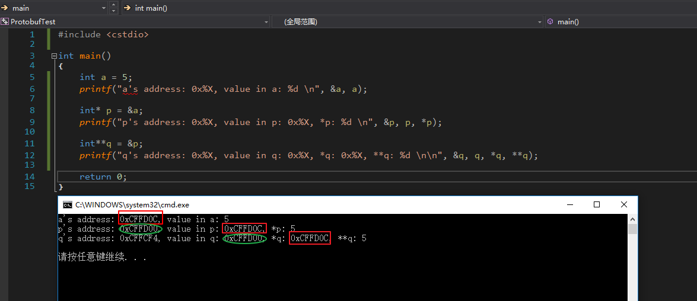

# 变量、指针和内存 #

## 图例 ##



## 什么是内存 ##

内存是计算机的重要组成部分，就是我们平常所说的电脑装了多大的内存条，单位换算为

* 1GB = 1024 MB
* 1MB = 1024 KB
* 1KB = 1024 Byte
* 1Byte = 8bit

内存的作用就是操作系统和程序的运行空间，比如双击了某个exe程序，操作系统会将这个程序加载到内存中去执行，也就是内存是程序运行时的容器，保存了程序运行过程中产生的各种数据，也就是说我们平常写程序过程中，用到的各种变量，他们就是保存在了内存中

## 变量 ##

### int a = 5; ###

最简单的，声明了一个整型变量 `a`，计算机执行到这句代码的时候，会为 `a` 分配一个地址空间，用来保存相应的数据，如图所示，计算机为 `a` 分配到的内存的地址是 **0x0004**，并将 `5` 这个值保存在其中。所以变量 `a` 其实和 `内存地址0x0004` 是等价的。

### int* p = &a; ###

这句代码声明了一个指针变量 `p`，计算机执行到这句代码的时候，也会为 `p` 分配一个地址空间，用来保存相应的数据，如图所示，计算机为 `p` 分配到的内存的地址是 **0x0010**，并将变量`a`的地址**0x0004**做为值保存在其中。所以变量 `p` 其实和 `内存地址0x0010` 是等价的。

### int** q = &p; ###

这句代码声明了一个指针变量(也可以说是二级指针，pointer to pointer) `q`，计算机执行到这句代码的时候，也会为 `q` 分配一个地址空间，用来保存相应的数据，如图所示，计算机为 `q` 分配到的内存的地址是 **0x0018**，并将变量`p`的地址**0x0010**做为值保存在其中。所以变量 `q` 其实和 `内存地址0x0018` 是等价的。

### 普通变量和指针变量的区别 ###

实际上可以这么类比，程序的地址空间，可以看成是一栋一栋房子，每一栋房子都有一个地址，比如xx路xx号，在程序里就是， **0x0004, 0x0010, 0x0018**。然后这些房子又有一个别名，比如张三的房子，李四的房子，这些别名在程序里就是 **a, q, p** 这些变量名。也就是说 **0x0004, 0x0010, 0x0018** 和 **a, q, p** 是等价的，但是程序里使用的是 **a, q, p** 这些，就好像你去同学家里玩，你会说你去张三家里玩，而不是说你去xx路xx号玩。

所以，**a, q, p** 这些变量名其实是一样的，都代表了一个房子(程序地址)，他们本身的地址不会变，就好像xx路xx号永远是xx路xx号，但是里面的保存的值是会变的，就好像房子里面住的人会变来变去。所以这些变量之间的区别就是他们保存的值不一样，**a**保存的是一个整数值**5**，可以理解成**a**这栋房子里住了一个人，**q**和**p**是指针，意思就是说他们的房子里不能住人，只能保存另一栋房子的地址，当程序来到他们的房子里找人的时候(取值)，是找不到人的，但是会拿到另一栋房子的地址，程序会自动地再去新的地址里去找人。

``` cpp
int a = 5; // 张三的房子(a)(实际地址为0x0004) 里面住进去 5

// &a，意思就是让a说出自己的房子的地址，也就是0x0004
// a, 意思就是让a说出自己房子里面是什么东西，也就是5
printf("a's address: 0x%X, value in a: %d \n", &a, a);
```

``` cpp
int* p = &a; // 李四的房子(p)(实际地址为0x0010)里面不住人，但是保存了张三的房子(a)的地址0x0004

// &p，同上，让p说出自己房子的实际地址，也就是0x0010
// p，同上，让p说出自己房子里面是什么东西，也就是张三房子的地址0x0004
// *p，意思就是让p说出他里面保存的那个地址的房子里面是什么东西，其实就是说出a的房子里面是什么东西，也就是5
printf("p's address: 0x%X, value in p: 0x%X, *p: %d \n", &p, p, *p);
```

``` cpp
int**q = &p; // 王五的房子(q)(实际地址为0x0018)里面也不住人，保存的是李四的房子(p)的地址0x0010

// &q，同上，输出王五(q)自己的房子的地址，也就是0x0018
// q，同上，输出王五房子里保存的东西，也就是李四的房子的地址0x0010
// *q，同上，输出王五房子里保存的那个地址的房子里是什么东西，其实就是p这个房子里的东西，也就是 0x0004，还是一个地址
// **q，可以看成是 *(*q)，先进行一次*q，就得到0x0004，再进行一次取值操作，相当于 *(0x0004)，就取出0x0004这个地址里的东西，也就是 5
printf("q's address: 0x%X, value in q: 0x%X, *q: 0x%X, **q: %d \n\n", &q, q, *q, **q);
```

### 程序输出结果 ###

